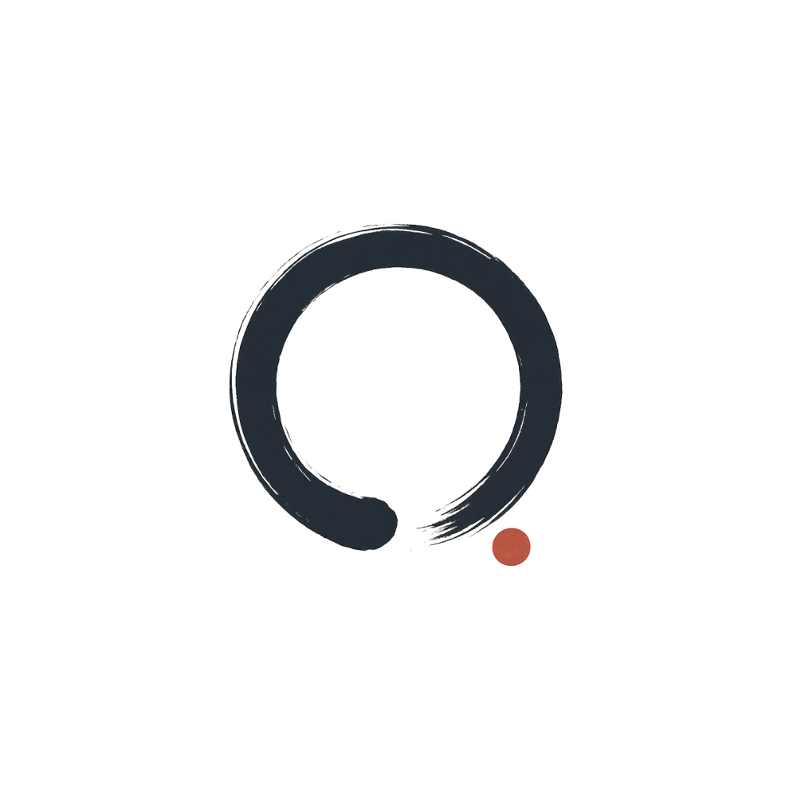

<p align="center"></p>

<h1 align="center">Kaizen</h1>
<div align="center"> 
  <!-- MIT License -->
  <a href="./LICENSE">
    
  </a>
  <!-- CLI -->
  <a href="./kaizen-parser">
    
  </a>
  <!-- WEBSITE -->
  <a href="./website">
    
  </a>
  <!-- Kaizen Nightly Builds -->
  <a href="https://github.com/josimar-silva/kaizen/actions/workflows/kaizen.yaml">
    
  </a>
  <!-- Kaizen Health -->
  <a href="https://kaizen.josimar-silva.com/">
    
  </a>
  <!-- Kaizen uptime -->
  <a href="https://kaizen.josimar-silva.com/">
    
  </a>
  <!-- Kaizen Response Time -->
  <a href="https://kaizen.josimar-silva.com/">
    
  </a>
  <!-- OSSF Score Card -->
  <a href="https://scorecard.dev/viewer/?uri=github.com/josimar-silva/kaizen">
    
  </a>
  <!-- CodeQL Advanced -->
  <a href="https://github.com/josimar-silva/kaizen/actions/workflows/codeql.yaml">
    
  </a>
  <!-- Docker Builds -->
  <a href="https://github.com/josimar-silva/kaizen/actions/workflows/docker-website.yaml">
    
  </a>
  <!-- Deploy -->
  <a href="https://github.com/josimar-silva/kaizen/actions/workflows/deploy-website.yaml">
    
  </a>
</div>
<div align="center">
  <strong>Continuous Improvement Journal</strong>
</div>

<div align="center">
  One solution a day keeps the rust away.
</div>

<div align="center">
  <sub>Built with <i>viele</i> ☕️ by
  <a href="https://josimar-silva.com">Josimar Silva</a>.
</div>


# Introduction

**Kaizen** (改善) is a Japanese term meaning "change for the better" or "continuous improvement". 
This project embodies that philosophy by providing a personal, automated journal to track and visualize your daily progress in algorithm and system design challenges.

It's designed for software engineers who regularly solve coding problems or study system design, allowing them to maintain a self-updating portfolio that showcases their learning journey directly from their Git commit history.

## 💡 Core Concept

The project operates on a simple principle:

1.  **Commit with Structure**: You commit your daily algorithm solutions or system design notes to a Git repository using a specific commit message convention.
2.  **Parse & Generate**: A Rust-based CLI tool (`kaizen-parser`) automatically parses these structured commit messages to extract relevant data (title, notes, language, type, GitHub link).
3.  **Visualize**: A Next.js frontend application (`website`) consumes this generated data to present a clean, minimalist interface featuring a GitHub-style calendar heatmap and a chronological timeline of your progress.

This creates a seamless workflow where your daily coding practice directly feeds into a visually appealing and informative personal journal.

## 📦 Project Structure

This repository is a monorepo composed of two main components:

-   ### `kaizen-parser` (Rust CLI)
    A powerful Rust-based command-line interface that acts as the backend data processor. It's responsible for:
    -   Parsing Git commit messages that adhere to a predefined convention.
    -   Extracting structured information about your daily coding challenges and notes.
    -   Generating a `data.json` file, which serves as the primary data source for the frontend.

    For detailed information on its features, usage, and commit conventions, please refer to the [Kaizen Parser README](./kaizen-parser/README.md).

-   ### `website` (Next.js Static Website)
    A modern Next.js and TypeScript application that serves as the user interface for your Kaizen journal. It focuses on:
    -   Consuming the `data.json` file generated by the parser.
    -   Presenting your progress through an interactive calendar heatmap.
    -   Displaying a detailed chronological timeline of your solved problems and notes.
    -   Providing a minimalist and clean user experience.

    To learn more about its features, setup, and deployment, please visit the [Website Frontend README](./website/README.md).

## 🚀 Getting Started

To get started with the Kaizen project, you'll typically interact with both the parser and the frontend. Follow these general steps:

1.  **Clone the Repository**:
    ```bash
    git clone https://github.com/josimar-silva/kaizen.git
    cd kaizen
    ```
2.  **Set up the Parser**: Navigate to the `kaizen-parser` directory and follow the instructions in its [README](./kaizen-parser/README.md) to build and run the CLI tool. This will generate your `data.json` file.
3.  **Set up the Website**: Navigate to the `website` directory and follow the instructions in its [README](./website/README.md) to install dependencies, build, and run the frontend application.

## 🤝 Contributing

We welcome contributions to the Kaizen project! If you're interested in improving the parser, enhancing the frontend, or adding new features, please see our [Contributing Guidelines](./kaizen-parser/CONTRIBUTING.md) for more information.

## 📄 License

This project is licensed under the MIT License. See the [LICENSE](./LICENSE) file for details.
